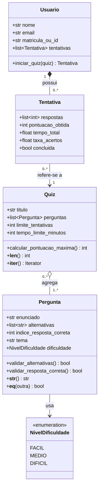

Sistema de Quiz Educacional

Programação Orientada a Objetos — Sistema de Quiz Educacional.

## Descrição

O projeto modela um sistema no qual perguntas de múltipla escolha são organizadas em quizzes. Usuários poderão responder aos quizzes, registrar tentativas e acompanhar o próprio desempenho. Nesta primeira entrega, o repositório apresenta a modelagem e a estrutura inicial do código; as funcionalidades ainda não estão implementadas.

## Objetivo

Planejar uma solução orientada a objetos para cadastrar perguntas, reunir perguntas em quizzes e representar as tentativas dos usuários. A modelagem deverá servir de base para as validações, pontuação e relatórios previstos nas etapas seguintes.

## Funcionalidades

- Cadastrar perguntas com enunciado, tema, dificuldade e três a cinco alternativas.

- Montar quizzes com perguntas de um ou mais temas.

- Permitir que usuários respondam a quizzes dentro dos limites configurados.

- Registrar respostas, pontuação, tempo gasto e taxa de acertos por tentativa.

- Apresentar gabarito e relatórios de desempenho em etapas futuras.

Aqui eu separo a pessoa que responde (Usuario), o conjunto de perguntas (Quiz), cada item de múltipla escolha (Pergunta) e o registro de uma execução (Tentativa). O enum NivelDificuldade restringe a dificuldade de uma pergunta a fácil, médio ou difícil.7

As alternativas são textos na lista de Pergunta, pois a especificação não exige uma classe própria para elas. A especificação chama Pergunta de classe base, mas não define subclasses: nenhuma herança concreta foi adicionada ao diagrama nesta etapa. Os métodos abaixo representam responsabilidades planejadas, sem lógica implementada.

## Classes

# Usuario

Responsabilidade:  
Identificar quem responde aos quizzes e manter o histórico de suas tentativas.

Atributos:
- `nome`
- `email`
- `matriculaOuId`
- `tentativas`

Métodos principais:
- `iniciarQuiz()`

# Quiz

Responsabilidade: 
Reunir as perguntas do quiz e definir os limites e regras de execução.

Atributos:
- `titulo`
- `perguntas`
- `limiteTentativas`
- `tempoLimiteMinutos`

Métodos principais:
- `calcularPontuacaoMaxima()`
- `__len__()`
- `__iter__()`

# Pergunta

Responsabilidade:  
Representar uma pergunta do quiz, incluindo seu enunciado, alternativas, tema, dificuldade e resposta correta.

Atributos:
- `enunciado`
- `alternativas`
- `indiceRespostaCorreta`
- `tema`
- `dificuldade`

Métodos principais:
- `validarAlternativas()`
- `validarRespostaCorreta()`
- `__str__()`
- `__eq__()`

# Tentativa

Responsabilidade: 
Registrar os dados e o resultado de uma execução do quiz realizada por um usuário.

Atributos:
- `respostas`
- `pontuacaoObtida`
- `tempoTotal`
- `taxaAcertos`
- `concluida`

Métodos principais:
- Os métodos relacionados à execução da tentativa serão definidos nas próximas etapas do projeto.

---

# NivelDificuldade

Tipo: `Enum`

Responsabilidade: 
Restringir e padronizar os níveis de dificuldade disponíveis para as perguntas.

Valores:
- `FACIL`
- `MEDIO`
- `DIFICIL`

A descrição detalhada de atributos, tipos e decisões está em [uml.md](docs/uml.md).
Relacionamentos
Ligação	Tipo	Cardinalidade	Justificativa
Quiz → Pergunta	Agregação	Cada quiz contém 1..* perguntas; cada pergunta pode integrar 0..* quizzes.	Uma pergunta pode existir sem o quiz e ser reutilizada.
Usuario → Tentativa	Composição no domínio	Cada usuário possui 0..* tentativas; cada tentativa pertence a 1 usuário.	A tentativa compõe o histórico do usuário.
Tentativa → Quiz	Associação	Cada tentativa se refere a 1 quiz; cada quiz pode ter 0..* tentativas.	É necessário saber qual quiz foi respondido.
Pergunta → NivelDificuldade	Uso de enum	Cada pergunta tem 1 nível.	Somente os três valores previstos são admitidos.

## Organização

sistema-quiz-educacional/
├── .gitignore                  
├── README.md                   
├── main.py                     
├── docs/
│   └── uml.md                  
└── models/
    ├── __init__.py
    ├── nivel_dificuldade.py
    ├── pergunta.py
    ├── quiz.py
    ├── tentativa.py
    └── usuario.py

# Diagrama UML

Autor

José Felipe dos Santos Souza — Engenharia de Software