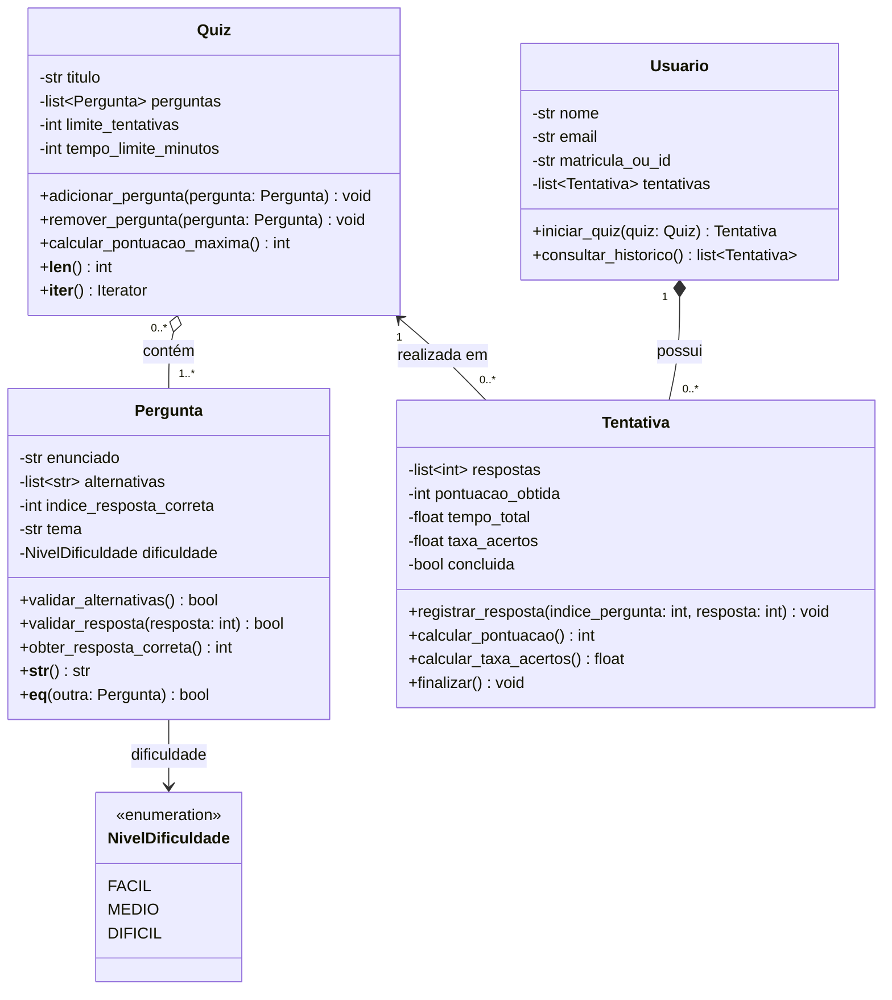

O sistema permite cadastrar perguntas de múltipla escolha, agrupá-las em quizzes e registrar as tentativas de usuários. Os relatórios, a persistência e a interface são requisitos de etapas posteriores e não aparecem como classes nesta primeira modelagem.
Decisões para validar
- Cada alternativa é uma String na lista de Pergunta: a especificação exige de 3 a 5 alternativas e um índice correto, mas não define uma entidade Alternativa com identidade ou comportamento próprios.
- NivelDificuldade representa os três valores previstos: FACIL, MEDIO e DIFICIL.
- Pergunta é descrita na especificação como classe base, mas nenhuma subclasse é identificada. Não foi inventada uma herança apenas para preencher o diagrama. O requisito geral de herança, inclusive múltipla, deverá ser discutido com o professor quando o modelo concreto for definido.
- Os tipos e métodos abaixo indicam responsabilidades futuras, não código já entregue.

UML textual
Usuario
Responsabilidade: identificar quem responde aos quizzes e manter seu histórico de tentativas.
Atributo	Tipo	Significado
nome	String	Nome do usuário.
email	String	E-mail do usuário.
matriculaOuId	String	Identificador informado no cadastro.
tentativas	List<Tentativa>	Histórico associado ao usuário.

Método principal: iniciarQuiz(quiz: Quiz) -> Tentativa, sujeito à validação do limite de tentativas em etapa futura.
Quiz
Responsabilidade: agrupar perguntas e definir as condições para respondê-las.
Atributo	Tipo	Significado
titulo	String	Nome do quiz.
perguntas	List<Pergunta>	Perguntas utilizadas no quiz.
limiteTentativas	int	Quantas vezes cada usuário pode tentar responder.
tempoLimiteMinutos	int?	Tempo máximo opcional; ausente quando não houver limite.

Métodos principais: calcularPontuacaoMaxima() -> int, __len__() -> int e __iter__() -> Iterator.
Pergunta
Responsabilidade: representar um enunciado de múltipla escolha, seu tema, dificuldade e gabarito.
Atributo	Tipo	Significado
enunciado	String	Texto da pergunta.
alternativas	List<String>	Entre três e cinco opções de resposta.
indiceRespostaCorreta	int	Posição válida na lista de alternativas.
tema	String	Assunto ao qual pertence a pergunta.
dificuldade	NivelDificuldade	Um dos níveis previstos.

Métodos principais: validarAlternativas() -> bool, validarRespostaCorreta() -> bool, __str__() -> String e __eq__(outra: Pergunta) -> bool. A comparação por igualdade considera enunciado e tema, conforme a especificação.
Tentativa
Responsabilidade: registrar uma execução de determinado quiz por determinado usuário.
Atributo	Tipo	Significado
respostas	List<int>	Índices das alternativas escolhidas, na ordem das perguntas.
pontuacaoObtida	int	Pontuação alcançada.
tempoTotal	float	Tempo gasto, em minutos.
taxaAcertos	float	Proporção de respostas corretas.
concluida	bool	Indica se a tentativa foi finalizada.

