# Modelo das classes base

O sistema organiza perguntas de múltipla escolha em quizzes e registra tentativas de usuários. Nesta etapa, as classes têm construtores, atributos internos e propriedades de leitura. As propriedades de coleção retornam cópias de listas, preservando a lista interna da classe.

## Decisões do modelo

- As alternativas são textos; não há uma classe `Alternativa` porque elas não têm identidade ou comportamento próprio nesta etapa.
- `NivelDificuldade` limita a dificuldade aos valores `FACIL`, `MEDIO` e `DIFICIL`.
- `Pergunta` não tem subclasses, pois o escopo não especifica tipos especializados de pergunta.
- A pontuação máxima do quiz considera um ponto por pergunta.
- O fluxo de responder, calcular resultados e finalizar tentativas será desenvolvido em etapas posteriores.

## API das classes

### Usuario

Propriedades somente para leitura: `nome`, `email`, `matricula_ou_id` e `tentativas`. O construtor recebe nome, e-mail e matrícula ou ID. `iniciar_quiz(quiz)` cria uma tentativa associada ao usuário e ao quiz; `consultar_historico()` retorna uma lista com as tentativas.

### Quiz

Propriedades somente para leitura: `titulo`, `perguntas`, `limite_tentativas` e `tempo_limite_minutos`. O tempo limite é opcional. Os métodos `adicionar_pergunta()` e `remover_pergunta()` gerenciam as perguntas; `calcular_pontuacao_maxima()`, `__len__()` e `__iter__()` consultam o quiz.

### Pergunta

Propriedades somente para leitura: `enunciado`, `alternativas`, `indice_resposta_correta`, `tema` e `dificuldade`. O construtor exige de três a cinco alternativas textuais e um índice correto válido. `validar_alternativas()` e `validar_resposta_correta()` verificam essas condições. A igualdade entre perguntas considera enunciado e tema.

### Tentativa

O construtor associa a tentativa a um `Usuario` e a um `Quiz`. As propriedades de leitura são `usuario`, `quiz`, `respostas`, `pontuacao_obtida`, `tempo_total`, `taxa_acertos` e `concluida`. Uma tentativa nova começa sem respostas, com resultados zerados e ainda não concluída.

## Diagrama

```mermaid
classDiagram
    class Usuario {
        -str _nome
        -str _email
        -str _matricula_ou_id
        -list~Tentativa~ _tentativas
        +str nome
        +str email
        +str matricula_ou_id
        +list~Tentativa~ tentativas
        +iniciar_quiz(quiz) Tentativa
        +consultar_historico() list~Tentativa~
    }

    class Quiz {
        -str _titulo
        -list~Pergunta~ _perguntas
        -int _limite_tentativas
        -int? _tempo_limite_minutos
        +str titulo
        +list~Pergunta~ perguntas
        +int limite_tentativas
        +int? tempo_limite_minutos
        +adicionar_pergunta(pergunta) void
        +remover_pergunta(pergunta) void
        +calcular_pontuacao_maxima() int
        +__len__() int
        +__iter__() Iterator~Pergunta~
    }

    class Pergunta {
        -str _enunciado
        -list~str~ _alternativas
        -int _indice_resposta_correta
        -str _tema
        -NivelDificuldade _dificuldade
        +str enunciado
        +list~str~ alternativas
        +int indice_resposta_correta
        +str tema
        +NivelDificuldade dificuldade
        +validar_alternativas() bool
        +validar_resposta_correta() bool
        +__str__() str
        +__eq__(outra) bool
    }

    class Tentativa {
        -list~int~ _respostas
        -int _pontuacao_obtida
        -float _tempo_total
        -float _taxa_acertos
        -bool _concluida
        +Usuario usuario
        +Quiz quiz
        +list~int~ respostas
        +int pontuacao_obtida
        +float tempo_total
        +float taxa_acertos
        +bool concluida
    }

    class NivelDificuldade {
        <<enumeration>>
        FACIL
        MEDIO
        DIFICIL
    }

    Quiz "0..*" o-- "0..*" Pergunta : reúne
    Usuario "1" *-- "0..*" Tentativa : mantém histórico
    Tentativa "0..*" --> "1" Quiz : referencia
    Pergunta --> NivelDificuldade : usa
```

